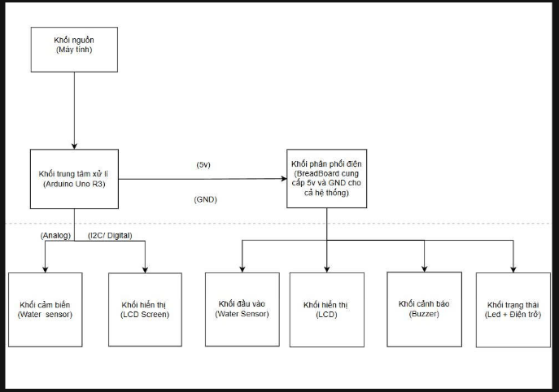
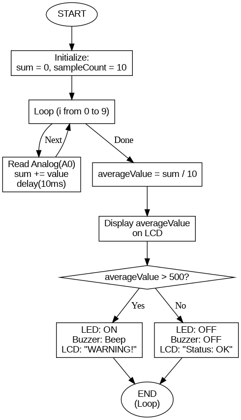

# Automatic-Flood-Risk-Warning-System
An Arduino-based sensor monitoring system featuring a 10-sample moving average filter for noise reduction, LCD visualization, and automated threshold alerts.
# Flood Warning System with Noise Filtering Algorithm

## 1. Introduction & Motivation
Flooding has become a significant threat due to climate change and rapid urbanization, which reduces natural drainage. Many areas currently lack a real-time, automatic warning system, leading to delayed responses and increased risks to human safety and property. 

This project was developed to provide a low-cost, reliable, and continuous monitoring solution that detects rising water levels and triggers immediate alerts without human intervention.

## 2. Key Technical Feature: Noise Reduction
The core highlight of this system is the implementation of a **10-sample Moving Average Filter**. 
* **The Problem:** Raw sensor data often fluctuates (jitter) due to water ripples or electrical interference.
* **The Solution:** The system collects 10 consecutive readings with a 10ms delay between each, then calculates the average.
* **The Result:** Provides stable data for the LCD display and prevents false alarms from the buzzer and LED.

## 3. System Architecture
The following diagram illustrates the hardware connection and data flow from the sensor to the processing unit and output devices.

## 4. Operational Flowchart
This flowchart describes the logic of the firmware, specifically the data acquisition loop and the conditional alert triggers.

## 5. Components & Connections
| Component | Connection | Function |
| :--- | :--- | :--- |
| **Arduino Uno** | Main Controller | Processes data and executes logic. |
| **Water Level Sensor** | Pin A0 | Detects water level (Analog). |
| **I2C LCD 16x2** | SDA/SCL Pins | Visualizes real-time status and values. |
| **Warning LED** | Pin 8 | Visual alert for high water levels. |
| **Piezo Buzzer** | Pin 9 | Audible alarm for emergency status. |

## 6. How to Use
1. Connect the hardware according to the **System Block Diagram**.
2. Install the `LiquidCrystal_I2C` library in your Arduino IDE.
3. Open the `flood_warning_system.ino` file and upload it to your Arduino Uno.
4. Monitor the water level on the LCD; the system will automatically trigger alerts if the value exceeds 500.

---
*Developed as part of a real-time monitoring system project.*
